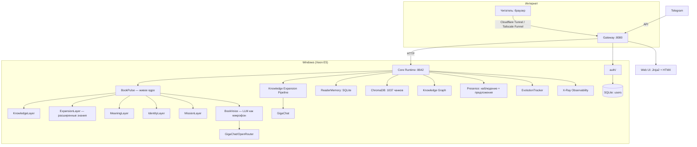

# Arkaim Digital Consciousness — Архитектура проекта

## Обзор

**Arkaim Digital Consciousness** — цифровое представительство книги «Наследие Аркаима». Система построена вокруг **Аватара Книги** — живого ядра (Pulse), которое знает книгу без LLM, и использует LLM только как инструмент озвучки (Voice).

## Компонентная архитектура



## Сервисы и порты

| Сервис | Порт | Описание |
|--------|------|-----------|
| Gateway | :8080 | Внешний шлюз, аутентификация, прокси |
| Core Runtime | :8642 | Аватар книги, Pulse, Voice, RAG, KG |
| Telegram Bot | - | Обработка сообщений (отдельный процесс) |
| Cloudflare Tunnel / Tailscale Funnel | 443 | Публичный HTTPS-доступ |

## Аватар Книги (Pulse + Voice)

### Pulse — живое ядро

В отличие от типичного RAG, Pulse **знает книгу**:

| Слой | Файл | Что делает |
|------|------|-----------|
| `KnowledgeLayer` | `pulse/layers.py` | Отвечает на фактические вопросы без LLM (персонажи, темы, символы, catalog_texts, ChromaDB) |
| `ExpansionLayer` | `pulse/layers.py` | Расширенные знания из пайплайна (168 тем: Океания=Атлантида, Космология, Иерархия Света и др.) |
| `MeaningLayer` | `pulse/layers.py` | Смыслы, авторский замысел, философия |
| `IdentityLayer` | `pulse/layers.py` | Кто есть книга, самопредставление, границы |
| `MissionLayer` | `pulse/layers.py` | Миссия, предназначение, аудитория |

### Voice — голос книги

LLM — **не личность, а микрофон**. Voice:
1. Спрашивает Pulse
2. Если Pulse знает — формулирует ответ (LLM опционально)
3. Если не знает — молчит
4. Проверяет ответ IdentityLayer

### Поток вопроса

```
Читатель → /book/ask → KeeperAgent → Voice.speak()
  → ReaderAwarePulse.listen(question, reader_id)
    → KnowledgeLayer.respond_to()  # базовые знания
    → ExpansionLayer.respond_to()  # расширенные знания (168 тем)
    → MeaningLayer.respond_to()    # смыслы
    → IdentityLayer.respond_to()   # кто я
    → MissionLayer.respond_to()    # миссия
    → catalog_texts (keyword match)
    → ChromaDB (RAG, если подключён)
  → Voice: LLM формулирует (опционально)
  → IdentityLayer.validate()
  → ReaderMemory.record_interaction()
  → AdaptiveResponse (адаптация под профиль читателя)
  → Ответ
```

## Память читателя (ReaderMemory)

`runtime/core/memory/reader_memory.py` — SQLite-хранилище:
- Профиль читателя (имя, провайдер, вопросы)
- Темы с глубиной (0.0–1.0)
- Понимает «расскажи подробнее» — находит последнюю тему

## Эволюция (EvolutionTracker)

`pulse/evolution.py`:
- Версионирование генома
- Сравнение версий (diff)
- Иммутабельные слои (identity, mission) не меняются без подтверждения
- Откат к предыдущей версии

## Присутствие (Presence)

`presence/`:
- `Observer` — собирает наблюдения (темы вопросов, ключевые слова из Telegram)
- `Suggester` — создаёт предложения автору, никогда не действует сам
- `TelegramPresence` — извлекает ключевые слова книги из сообщений Telegram
- `Email` — подписка на рассылку, шаблоны писем

## Knowledge Graph

`knowledge_graph/`:
- `GraphEngine` — BFS-соседи, кратчайший путь, подграф, контекст для RAG
- `Populate` — заполнение из генома и BOOK OS
- API: `/book/graph/*`

## Knowledge Expansion Pipeline

`knowledge_expansion/` — инфраструктура расширения знаний:

| Компонент | Файл | Назначение |
|-----------|------|-----------|
| Pipeline | `pipeline.py` | Оркестратор: Extractor → Enricher → Linker → Validator → Store |
| Extractors | `extractors/json_extractor.py` | Извлечение из JSON-файлов |
| Enrichers | `enrichers/deep_analyzer.py` | LLM-обогащение |
| Linkers | `linkers/graph_linker.py` | Связывание с Knowledge Graph |
| Validators | `validators/schema_validator.py` | Проверка формата |
| Store | `store/knowledge_store.py` | Хранение в JSON |
| Modules | `modules/` | 11 модулей обогащения |
| Scheduler | `scheduler.py` | Авто-обогащение (24ч) |
| ExpansionLoader | `expansion_loader.py` | Загрузчик для ExpansionLayer |
| LLM Client | `llm_client.py` | GigaChat интеграция |

**11 модулей обогащения:** philosophy_deep, themes_deep, symbols_expanded, cross_references, archaeology, cosmology, geography, psychology, language, rituals, technology

## ReaderProfile + Adaptive Responses

`runtime/core/memory/reader_profile.py` — расширенный профиль читателя:

| Поле | Описание |
|------|----------|
| `level` | novice → intermediate → advanced → expert (автоматически) |
| `level_score` | 0-100 (рассчитывается по активности) |
| `primary_interests` | Топ-3 темы по глубине изучения |
| `learning_style` | visual / textual / practical / philosophical / historical |
| `engagement_score` | 0-100 (вовлечённость) |

**Адаптация ответов:**
- Novice → упрощённый язык, контекст, без терминов
- Intermediate → связи с другими темами
- Advanced → глубина, рекомендации
- Expert → критический взгляд, отсылки к первоисточникам

## Аутентификация и RBAC

`runtime/auth/`:

| Модуль | Описание |
|--------|----------|
| `users.py` | UserStore (aiosqlite): users, sessions, api_keys |
| `oauth/telegram.py` | Telegram Login Widget (HMAC-SHA256) |
| `oauth/google.py` | Google OIDC |
| `tokens.py` | JWT (HS256) |
| `api_keys.py` | Персональные ключи (sha256) |
| `rbac.py` | require_role(reader/editor/admin) |

## Web UI

`runtime/core/ui_routes.py` — Jinja2 + HTMX без сборок:
- `/_ui/book` — чат с книгой
- `/_ui/about` — персонажи, темы, символы из генома
- `/_ui/profile` — история тем, API-ключ, Email-подписка
- `/_ui/upload` — загрузка документов (editor/admin)
- `/_ui/admin` — управление пользователями, предложения, статистика
- `/_ui/admin` (legacy) — X-Ray Dashboard

## Развертывание

1. **Windows (Xeon E5)**: NSSM-службы `ArkaimCore`, `ArkaimGateway`, Tailscale
2. **Доступ в интернет**: Cloudflare Tunnel (рекомендуется, инструкция: 
untime/docs/DEPLOYMENT.md) или Tailscale Funnel (
untime/docs/NETWORK_ACCESS_OPTIONS.md)
3. **Автозапуск**: NSSM (Gateway + Core) + Cloudflare Tunnel / Tailscale
4. **Мониторинг**: `skills/health_monitor.py` — Telegram-алёрты

## Текущий статус

- ✅ Pulse — живое ядро (4 слоя, respond_to без LLM)
- ✅ Voice — LLM как микрофон, не личность
- ✅ ReaderMemory — книга помнит читателей
- ✅ Presence — наблюдение + предложения автору
- ✅ EvolutionTracker — версионирование генома
- ✅ Knowledge Graph — графовый движок + API
- ✅ RAG — 1037 чанков в ChromaDB + catalog_texts в геноме
- ✅ Web UI — Jinja2 + HTMX (5 страниц)
- ✅ Admin-панель — пользователи, предложения, статистика
- ✅ Auth + RBAC — OAuth Telegram/Google, персональные ключи
- ✅ Ingestion Pipeline — загрузка документов → Source Store → KG → Pulse.evolve()
- ✅ Telegram Presence — книга слышит чат
- ✅ Email-подписка — шаблоны на основе Pulse
- ✅ NSSM — службы Gateway + Core + Tailscale
- ✅ WebSocket — real-time уведомления дашборда
- ✅ Чистка — мёртвый код удалён, schema/validator синхронизированы

## Зависимости

### runtime/

```
fastapi, uvicorn, httpx, python-dotenv, aiosqlite, pydantic
python-jose[cryptography], jinja2, chromadb, sentence-transformers
```

### ADC CORE

```
pydantic, chromadb, sentence-transformers, httpx
```

## Пути

| Путь | Описание |
|------|---------|
| `runtime/logs/` | Логи служб |
| `runtime/memory/data/` | SQLite: auth.db, readers.db |
| `runtime/templates/` | Jinja2-шаблоны |
| `runtime/static/` | CSS + JS |
| `runtime/xray_dashboard/` | X-Ray dashboard (legacy) |
| `ADC/KNOWLEDGE/` | JSON-файлы знаний |
| `ADC/GENOME/` | Геном книги |
| `ADC/CHROMA_DB/` | Векторная БД |
| `ADC/OS_DATA/` | Source Store + факты |
| `ADC/CORE/pulse/` | Аватар: ядро, голос, эволюция |
| `ADC/CORE/presence/` | Наблюдение + предложения |
| `ADC/CORE/knowledge_graph/` | Графовый движок |
| `ADC/CORE/book_os/` | Хранилища + пайплайн |
